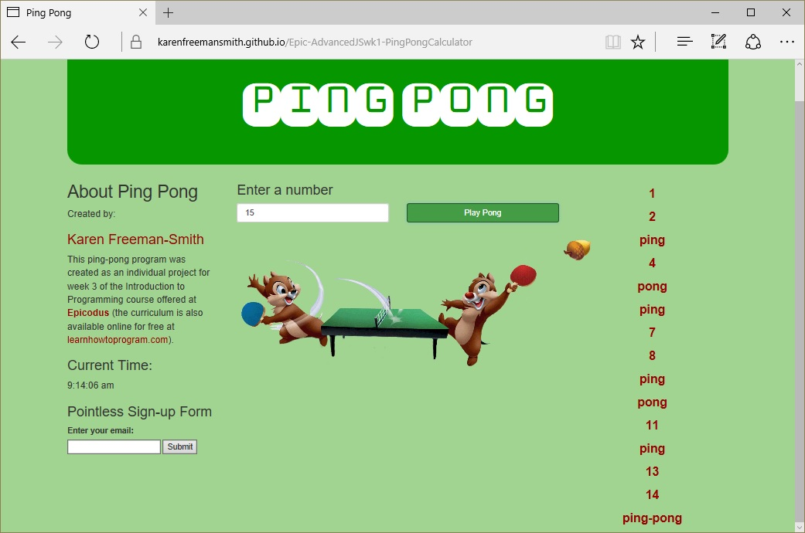

# Ping Pong Calculator
Version 0.0.2: January 3, 2017
by [Karen Freeman-Smith](https://github.com/karenfreemansmith)

## Description
Epicodus JavaScript week 1 project to build a calculator (including a ping-pong function).

### Technologies Used
HTML, CSS, JavaScript, Node.js, NPM, Gulp, Browserify, Uglify, Concat, Bower, and more!

### Specifications
* Refactor ping-pong webpage to use multiple .js files and a gulp pipeline to build and serve the pages locally.
* Use Bower to manage front-end dependencies: Bootstrap, jQuery, and Moment.js
* Add form handling (email form)
* Add moment.js to display time

## Setup/Installation
* Clone directory
* Run 'npm install'
* Run 'bower install'
* Type 'gulp serve'
-OR-
* [View on Github Pages](https://karenfreemansmith.github.io/Epic-AdvancedJSwk1-PingPongCalculator)

## Support & Contact
For questions, concerns, or suggestions please email karenfreemansmith@gmail.com

## Known Issues
* Still has problems with the timing of sound and animation

## Legal
*Licensed under the GNU General Public License v3.0*

Copyright (c) 2016 Copyright _Karen Freeman-Smith_ All Rights Reserved.
